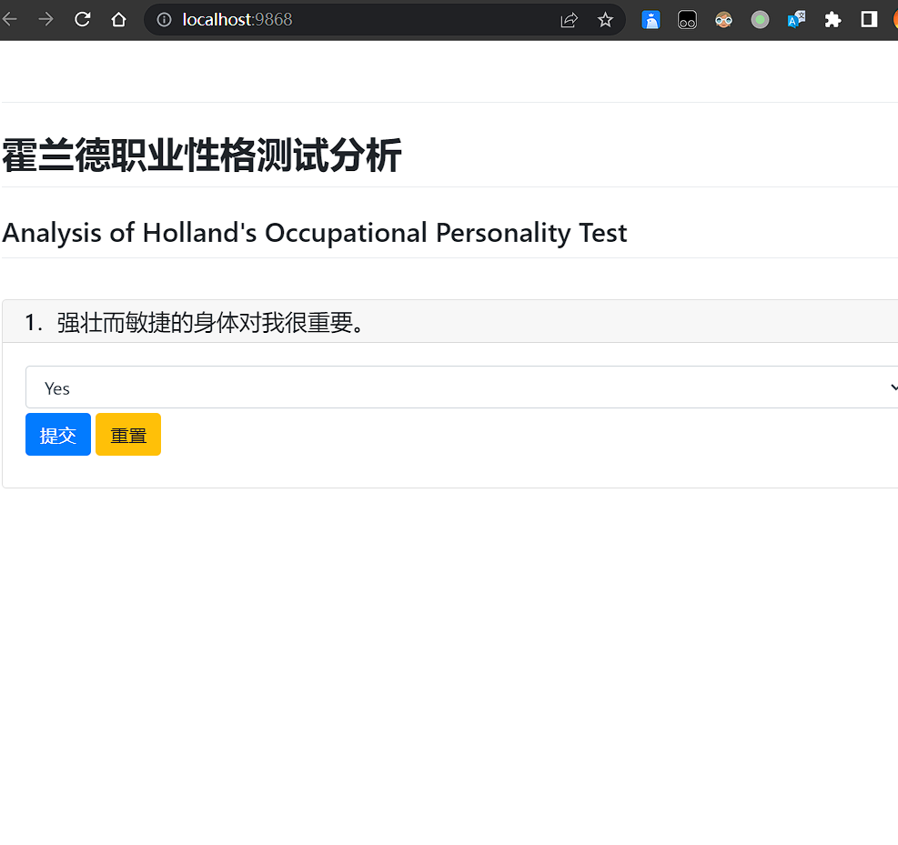
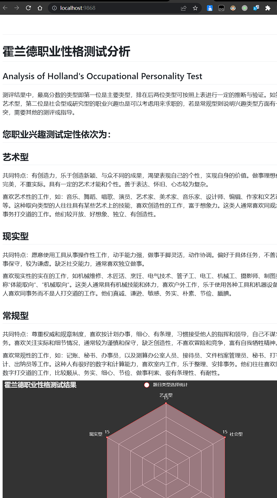

<h1 align="center">Analysis of Holland's Occupational Personality</h1>

<p align="center">
      
</p>

## Repository Introduction

Self Directed Search is an assessment tool developed by John Holland, an American career guidance expert, based on his extensive experience in Career counseling and his theory of career type. Holland believes that there should be an inherent correspondence between personal career interests and professions. According to different interests, personality can be divided into six dimensions: research-oriented (I), artistic (A), social (S), entrepreneurial (E), traditional (C), and realistic (R). Each person's personality is a combination of these six dimensions to varying degrees. This warehouse utilizes pyecharts and pywebio to present all questions in sequence and allow users to answer them to determine the final type of user use.  


## Install

This project uses [Python](https://www.python.org/) [Git](https://git-scm.com/). Go check them out if you don't have them locally installed.


```shell
$ git clone https://github.com/weiensong/Self-Directed-Search.git
```


## Usage
```sh
$ pip install -r requriements.txt

$ python3 ./AnalysisofHolland'sOccupationalPersonalityTest.py
```




## Related Repository

- [python](https://github.com/TheAlgorithms/Python) — All Algorithms implemented in Python
- [PyWebIO](https://github.com/pywebio/PyWebIO) — Write interactive web app in script way
- [pyecharts](https://github.com/pyecharts/pyecharts) — 人人可用的开源数据可视化分析工具


## Related Efforts

- [Google Scholar](https://scholar.google.com.hk/scholar?q=Analysis+of+Holland%27s+Occupational+Personality&hl=zh-CN&as_sdt=0&as_vis=1&oi=scholart)


## Maintainers

[@weiensong](https://github.com/weiensong)


## Contributing


Feel free to dive in! [Open an issue](https://github.com/weiensong/Self-Directed-Search/issues) or submit PRs.

Standard Python follows the [Python PEP-8](https://peps.python.org/pep-0008/) Code of Conduct.

### Contributors

This project exists thanks to all the people who contribute.


## License

[MIT](https://github.com/weiensong/weiensong/blob/main/.universal/LICENSE) © weiensong

